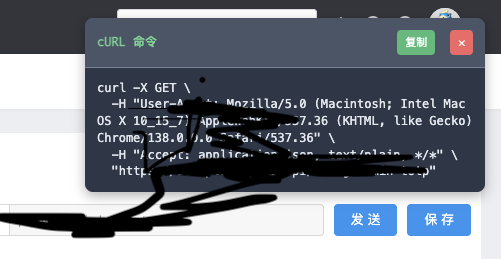

# Cross Request Master

一个专为 YApi 接口管理平台定制的 Chrome 扩展，用于绕过 CORS 限制并自动生成 cURL 命令。

## 功能特性

- 支持跨域请求，绕过浏览器 CORS 限制
- 自动生成 cURL 命令，一键复制分享
- 页面内实时显示，无需打开扩展弹窗
- 智能网站检测，仅在目标网站激活完整功能
- 专为 YApi 接口测试优化
- 已迁移至 Chrome Manifest V3



## 安装方法

1. 下载此仓库到本地
2. 打开 Chrome 浏览器，进入 `chrome://extensions/`
3. 开启右上角的"开发者模式"开关
4. 点击"加载已解压的扩展程序"
5. 选择项目文件夹

## 使用方法

### 在 YApi 中使用

1. 安装扩展后，在 YApi 接口页面正常发送请求
2. 扩展会自动在页面右上角显示对应的 cURL 命令
3. 点击"复制"按钮即可复制完整的 cURL 命令

### 在其他网页中使用

如果需要在非 YApi 网站使用跨域请求功能，可以在页面中调用：

```javascript
window.crossRequest({
    url: 'https://api.example.com/data',
    method: 'GET',
    headers: {
        'Authorization': 'Bearer token'
    },
    success: function(res, header, data) {
        console.log('响应数据:', res);
    },
    error: function(err, header, data) {
        console.error('请求失败:', err);
    }
});
```

**jQuery 使用说明**:

插件会根据网站类型采用不同的 jQuery 拦截策略：

**在 YApi 等目标网站上**（自动检测）:
- 默认拦截所有 jQuery ajax 请求
- 如需禁用插件，设置 `crossRequest: false`

```javascript
$.ajax({
    url: 'https://api.example.com/data',
    method: 'GET',
    crossRequest: false,  // 禁用插件拦截，使用原生 ajax
    success: function(data) {
        console.log(data);
    }
});
```

**在其他网站上**:
- 默认不拦截，需要显式启用
- 设置 `crossRequest: true` 才会使用插件

```javascript
$.ajax({
    url: 'https://api.example.com/data',
    method: 'GET',
    crossRequest: true,  // 在非目标网站上需要显式启用
    success: function(data) {
        console.log(data);
    }
});
```

## 工作原理

1. **智能检测**: 插件会检测当前网站是否为 YApi 或其他 API 管理平台
   - 检测 meta 标签中的 "yapi" 关键词
   - 检测 API 管理相关的组合关键词
   - 检测 URL 特征（需要路径+域名组合匹配）
   - 支持手动标记启用（`<meta name="cross-request-enabled">`）

2. **完整模式**（YApi 等目标网站）:
   - 启用 DOM 监听处理请求
   - 显示 cURL 命令弹窗
   - 输出调试日志
   - jQuery 默认拦截（可用 `crossRequest: false` 禁用）

3. **静默模式**（其他网站）:
   - 启用 DOM 监听（支持手动调用）
   - 关闭 cURL 弹窗和调试日志
   - jQuery opt-in 拦截（需要 `crossRequest: true`）

4. **消息通信**: 通过 content script 和 background service worker 处理跨域请求

## 安全注意事项

**重要提示**：

- 仅在开发环境使用，请勿在生产环境使用
- 扩展默认允许所有域名的请求，请谨慎使用
- 不要在银行、支付等敏感网站启用此扩展
- 插件会拦截并处理网络请求，可能影响网站正常功能

## 已知问题和解决方案

### Issue #15: jQuery 请求失败

**问题**: 在某些网站上使用 jQuery 的 `$.get` 等方法时，可能出现错误。

**解决方案**: v4.4.9 已修复此问题，jQuery 拦截改为 opt-in 模式，不再默认拦截所有请求。

### Issue #10: Extension context invalidated

**问题**: 扩展提示 "Extension context invalidated" 错误。

**解决方案**: v4.4.0 已修复此问题，移除了 localStorage 相关功能。

## 更新日志

### v4.4.11 (2025-10-17)

**改进检测启发式规则**

- 收紧网站检测规则，减少误报风险
  - 移除了单独的 `title.includes('api')` 判断（太宽泛）
  - 移除了单独的 `url.includes('/api/')` 判断（太常见）
  - API 管理平台检测需要多个关键词组合
  - URL 检测需要路径和域名同时匹配
- 新增手动启用选项
  - 用户可以在页面添加 `<meta name="cross-request-enabled">` 标记
  - 强制启用完整模式，适用于内部 API 管理系统
- 添加详细的测试指南（TESTING.md）

### v4.4.10 (2025-10-17)

**修复回归问题**

- 修复静默模式下 `window.crossRequest` 手动调用失败的问题
  - 静默模式现在仍然启用 DOM 监听，确保手动调用正常工作
  - 只关闭 UI 显示和调试日志，保持核心功能
- 修复 jQuery 拦截破坏 YApi 核心功能的问题
  - 智能模式：在 YApi 等目标网站默认拦截（可用 `crossRequest: false` 禁用）
  - 在其他网站改为 opt-in（需要 `crossRequest: true` 启用）
  - 保持向后兼容，YApi 无需修改代码

### v4.4.9 (2025-10-17)

**修复 Issue #15: jQuery 拦截导致其他网站请求失败**

- 修复 GET/HEAD 请求错误添加 Content-Type 的问题
- jQuery 拦截逻辑优化，根据网站类型采用不同策略
- 修复用户报告的 "GET/HEAD method cannot have body" 错误
- 感谢 @Rany-yilian 在 issue #15 中的详细反馈

### v4.4.8 (2025-10-17)

**重大优化: 智能网站检测，减少对其他网站的影响**

- 新增智能检测机制，自动识别 YApi 等 API 管理平台
- 在非目标网站上启用静默模式，只注入 API 不启动监听
- 大幅减少调试日志输出（静默模式下完全关闭）
- 在非目标网站上不显示 cURL 弹窗和错误提示
- 检测规则：
  - meta 关键词包含 "yapi"、"api管理"、"接口管理"
  - 页面标题包含 "yapi"、"接口测试"、"api"
  - URL 包含 /interface/、/project/、/api/ 等常见路径
- 性能优化：减少 DOM 观察和事件监听对其他网站的影响
- 更好的用户体验：不再污染其他网站的控制台

### v4.4.7 (2025-10-17)

**修复严重 bug: 插件导致其他网站不可用**

- 修复 content-script.js 中直接访问 `document.body` 的问题，当 body 不存在时会延迟初始化
- 修复 index.js 中所有 `document.body.appendChild()` 调用，添加 body 存在性检查
- 使用 `document.documentElement` 作为后备方案，确保在所有网站上都能正常运行
- 避免在页面加载早期阶段因 body 不存在而抛出错误

### v4.4.6 (2025-07-22)

- 重构 Content Script 架构
- 重新组织代码结构，创建独立的 content-script.js 文件
- 保留完整的跨域请求处理功能
- 整合 cURL 弹窗控制功能
- 改进调试日志和错误处理机制

### v4.4.5 (2025-07-21)

- 修复 cURL 弹窗不显示问题
- 修复 content script 中 this 上下文丢失的问题
- 改进事件监听器的调用方式，确保函数正确执行
- 添加详细的调试日志帮助排查问题

### v4.4.0 (2025-07-16)

- 修复 Extension context invalidated 错误
- 完全移除 localStorage 相关功能，避免存储访问冲突
- 简化扩展功能，专注于核心跨域请求处理
- 移除请求历史记录功能，减少内存占用

### v4.3.0 (2025-07-16)

- 简化扩展功能，移除复杂的域名白名单管理界面
- 强制允许所有域名，简化用户操作
- 移除不必要的调试信息显示

### v4.2.0 (2025-07-15)

- 修复 YApi 错误处理和响应格式问题
- 解决 "Cannot read properties of undefined" 错误
- 添加用户友好的错误提示界面
- 支持 application/x-www-form-urlencoded 请求格式

### v4.1.0 (2025-07-15)

- 新增 cURL 命令自动生成功能
- 页面内实时显示 cURL 命令弹窗
- 完整的请求历史管理
- 自动捕获请求头和认证信息
- 一键复制分享功能

### v4.0.1 (2025-06-26)

- 迁移到 Manifest V3
- 添加域名白名单管理功能
- 重构代码以提高安全性

## 技术栈

- Chrome Extension Manifest V3
- Service Worker (background script)
- Content Scripts
- Vanilla JavaScript

## 测试

详细的测试步骤和场景请参考 [TESTING.md](./TESTING.md)。

快速测试检查项：
- YApi 网站：cURL 弹窗显示 + jQuery 默认拦截
- 其他网站：无弹窗 + jQuery 不拦截 + 手动调用工作

## 开发

### 项目结构

```
cross-request-master/
├── manifest.json          # 扩展配置文件
├── background.js          # Service Worker（后台脚本）
├── content-script.js      # 内容脚本（注入到网页）
├── index.js              # 页面脚本（DOM 级别）
├── popup.html            # 扩展弹窗
├── popup.js              # 弹窗逻辑
├── jquery-3.1.1.js       # jQuery 库
└── icons/                # 图标资源
```

### 调试

1. 在 `chrome://extensions/` 页面点击"重新加载"
2. 打开浏览器控制台查看日志
3. 在 YApi 网站上测试功能

## 贡献

欢迎提交 Issue 和 Pull Request！

如果遇到问题：
1. 请先查看已知问题和更新日志
2. 提供详细的错误信息和复现步骤
3. 说明使用的 Chrome 版本和插件版本

## 许可证

MIT License

## 相关链接

- [GitHub Issues](https://github.com/leeguooooo/cross-request-master/issues)
- [Chrome Extension 开发文档](https://developer.chrome.com/docs/extensions/)
- [YApi 官网](https://github.com/YMFE/yapi)

## Star History

[](https://www.star-history.com/#leeguooooo/cross-request-master&Date)
