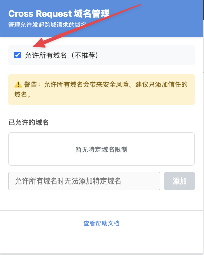

# Cross Request Master

一个用于绕过 CORS 限制的 Chrome 扩展，主要用于 YApi 接口管理平台。已升级至 Manifest V3。

🔧 **专为YApi定制的Chrome扩展**

## 功能特性

- ✅ 支持跨域请求，绕过浏览器 CORS 限制
- ✅ 域名白名单管理，提高安全性
- ✅ 已迁移至 Chrome Manifest V3
- ✅ 专为YApi接口测试优化

## 安装方法

### Chrome 扩展版本

1. 克隆或下载此仓库
```bash
git clone git@github.com:leeguooooo/cross-request-master.git
```

2. 打开 Chrome 浏览器，进入扩展管理页面
   - 在地址栏输入 `chrome://extensions/`
   - 或者通过菜单：更多工具 -> 扩展程序

3. 开启"开发者模式"（右上角开关）

4. 点击"加载已解压的扩展程序"

5. 选择项目文件夹

## 使用方法

扩展安装后会自动为页面提供跨域请求功能，主要用于YApi等接口管理平台。

### 域名白名单管理

1. 点击浏览器工具栏中的扩展图标
2. 在弹出窗口中管理允许的域名
3. 可以添加特定域名或使用通配符（如 `*.example.com`）
4. 不建议使用"允许所有域名"选项，存在安全风险

### 跨域问题解决

如果遇到跨域请求失败的问题，请按照以下步骤操作：



**重要提示**：如果遇到跨域问题，需要在插件弹出页面中勾选相关选项：

1. 点击浏览器工具栏中的 Cross Request 扩展图标
2. 在弹出的管理页面中，勾选"允许所有域名"选项
3. 或者添加特定的域名到白名单中
4. 刷新需要跨域请求的页面

⚠️ **注意**：勾选"允许所有域名"存在安全风险，建议仅在开发环境使用。

## 安全注意事项

⚠️ **重要安全提示**：

1. **仅在开发环境使用**：此扩展会绕过浏览器的 CORS 安全策略，请勿在生产环境使用
2. **限制域名访问**：始终使用域名白名单，避免允许所有域名
3. **定期审查权限**：定期检查并清理不需要的域名权限
4. **不要在敏感网站使用**：避免在银行、支付等敏感网站启用此扩展


## 技术细节

### Manifest V3 迁移

此扩展已从 Manifest V2 迁移到 V3，主要变化包括：

- 使用 Service Worker 替代后台页面
- 使用新的消息传递机制替代 blocking webRequest API
- 更严格的权限管理
- 改进的安全性

### 工作原理

**Chrome 扩展工作原理**：
1. 内容脚本注入到页面中，拦截跨域请求
2. 将请求转发到扩展的 Service Worker
3. Service Worker 使用 fetch API 发起实际请求（不受 CORS 限制）
4. 将响应返回给页面

该扩展通过Service Worker架构实现安全可靠的跨域请求处理。

## 开发

### 项目结构

```
cross-request-master/
├── manifest.json           # 扩展配置文件 (Manifest V3)
├── background.js           # Service Worker 脚本
├── response.js             # 内容脚本
├── index.js               # 注入到页面的脚本
├── popup.html             # 扩展弹出窗口
├── popup.js               # 弹出窗口脚本
├── icon.png               # 扩展图标
└── README.md              # 本文件
```

### 贡献

欢迎提交 Issue 和 Pull Request！

## 许可证

MIT License

## 更新日志

### v4.0.2 (2025-07-15)
- 📖 更新README为Chrome扩展专版
- 📋 添加详细的跨域问题解决说明
- 🖼️ 提供插件设置界面截图指导
- 🛡️ 增强安全提醒和最佳实践说明
- 🧹 简化文档结构，提高易读性

### v4.0.1 (2025-06-26)
- 迁移到 Manifest V3
- 添加域名白名单管理功能
- 重构代码以提高安全性
- 移除不安全的请求头修改功能
- 使用现代 JavaScript 语法重写