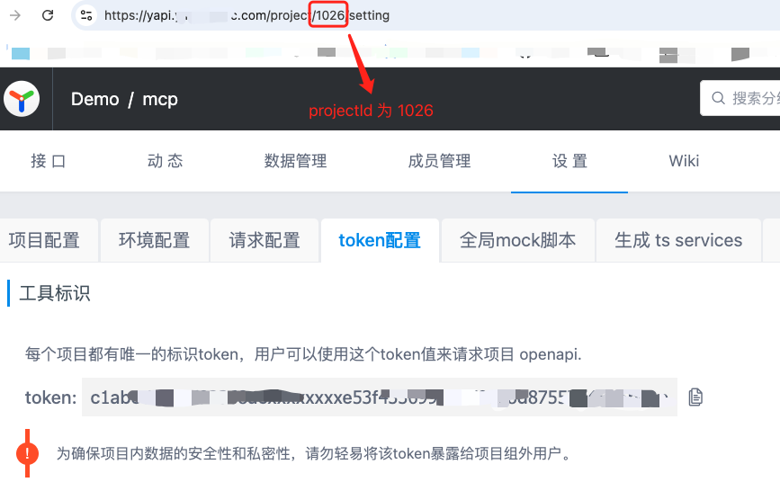
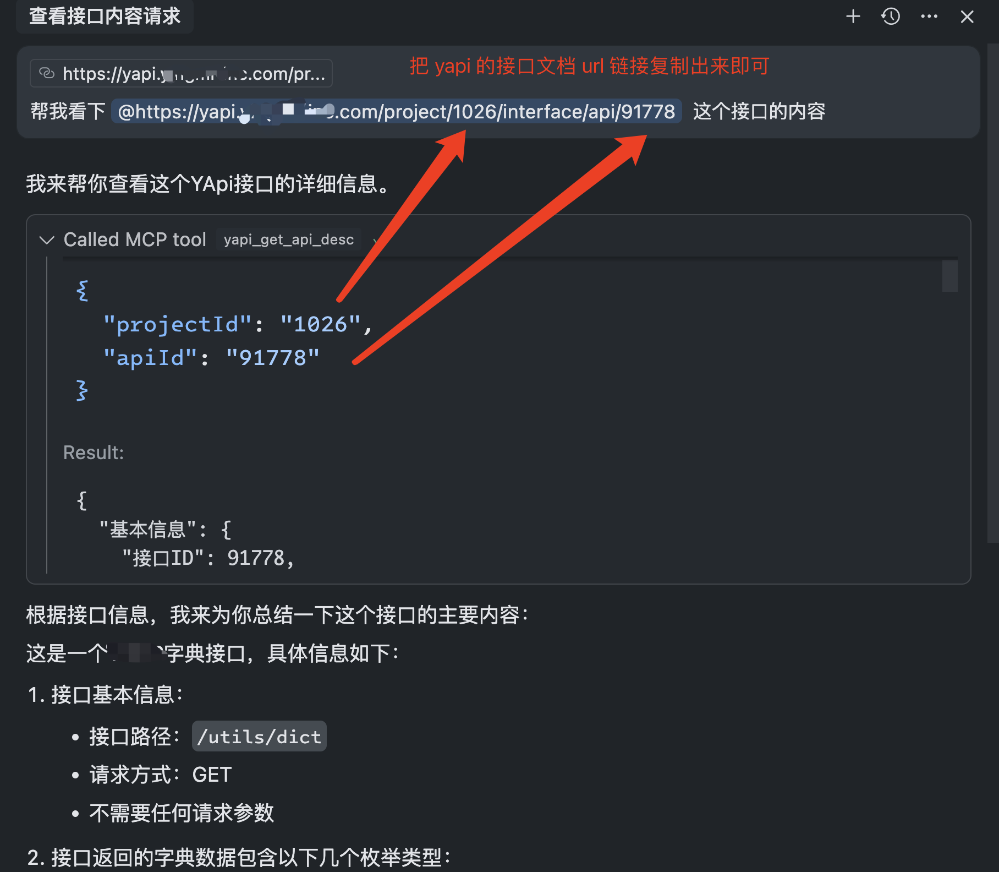

# Yapi Auto MCP Server

一个用于 YApi 的 Model Context Protocol (MCP) 服务器，让你能够在 Cursor 等 AI 编程工具中直接操作 YApi 接口文档。

## 项目简介

Yapi Auto MCP Server 是一个基于 [Model Context Protocol](https://modelcontextprotocol.io/) 的服务器，专为 YApi 接口管理平台设计。它允许你在 Cursor、Claude Desktop 等支持 MCP 的 AI 工具中直接：

- 🔍 **搜索和查看** YApi 项目中的接口文档
- ✏️ **创建和更新** 接口定义
- 📋 **管理项目和分类** 结构
- 🔗 **无缝集成** AI 编程工作流
- 🛠 **支持多个 YApi Project配置**

通过 MCP 协议，AI 助手可以理解你的 YApi 接口结构，在编程过程中提供更准确的建议和代码生成。

## 主要功能

### 🔍 接口查询和搜索

- **yapi_search_apis**: 按名称、路径、标签等条件搜索接口
- **yapi_get_api_desc**: 获取特定接口的详细信息（请求/响应结构、参数等）
- **yapi_interface_get**: 获取接口原始数据（对应 `/api/interface/get`）
- **yapi_interface_list**: 获取接口列表（对应 `/api/interface/list`）
- **yapi_interface_list_cat**: 获取分类下接口列表（对应 `/api/interface/list_cat`）
- **yapi_interface_list_menu**: 获取接口菜单列表（对应 `/api/interface/list_menu`）
- **yapi_list_projects**: 列出所有可访问的项目
- **yapi_project_get**: 获取项目详情（对应 `/api/project/get`）
- **yapi_get_categories**: 获取项目下的接口分类和接口列表（支持只返回分类/或包含接口列表）
- **yapi_interface_get_cat_menu**: 获取分类菜单（对应 `/api/interface/getCatMenu`）
- **yapi_update_token**: 全局模式登录并刷新本地登录态 Cookie（可选刷新项目/分类缓存）

### ✏️ 接口管理

- **yapi_save_api**: 创建新接口或更新现有接口
  - 支持完整的接口定义（路径、方法、参数、请求体、响应等）
  - 支持 JSON Schema 和表单数据格式
  - 自动处理接口状态和分类管理
  - 建议把「枚举值/中文备注/示例」优先写在 `req_params` / `req_query` / `req_headers` / `req_body_*` / `res_body`，`desc` 只写一句话简介；更新接口时未提供的字段会尽量保留原值
- **yapi_interface_add**: 新增接口（对应 `/api/interface/add`）
- **yapi_interface_up**: 更新接口（对应 `/api/interface/up`）
- **yapi_interface_save**: 新增或更新接口（对应 `/api/interface/save`）
- **yapi_interface_add_cat**: 新增接口分类（对应 `/api/interface/add_cat`）
- **yapi_open_import_data**: 服务端数据导入（对应 `/api/open/import_data`）

### 🎯 智能特性

- **多项目支持**: 同时管理多个 YApi 项目
- **缓存机制**: 提高查询响应速度
- **详细日志**: 便于调试和监控
- **灵活配置**: 支持环境变量和命令行参数

## 快速开始

### 推荐方式：用 Cross Request Master 一键安装 Skill（免手动找 Token）

如果你日常就在浏览器里使用 YApi，推荐安装 Chrome 扩展 [cross-request-master](https://github.com/leeguooooo/cross-request-master)。它会在 YApi 接口详情页（基本信息区域右上角）提供 **「YApi 工具箱」** 按钮，包含 Skill 一键安装（推荐，支持 `npx skills add`）/MCP 配置（兼容）/CLI docs-sync 说明；另外保留 **「复制给 AI」** 一键复制接口 Markdown：

- Skill 一键安装（推荐）：优先生成 `npx skills add` 命令安装仓库导出的 Skill，再配合 `yapi config init` 初始化全局配置；如需一步写入配置，保留 `yapi install-skill` 兼容路径
- MCP 配置（兼容）：使用 `--yapi-auth-mode=global`（账号密码），默认会自动懒登录；也可手动调用一次 `yapi_update_token` 预热缓存
- CLI 使用与 docs-sync：提供本地 CLI 安装命令和文档同步示例

### Skill 一键安装与 CLI

推荐先用 `skills` 安装仓库导出的 Skill：

```bash
# 推荐：把仓库里的 yapi Skill 装到全局 agent 目录
npx skills add leeguooooo/cross-request-master -y -g
```

这条命令只负责安装 Skill 文件，不会写入 `~/.yapi/config.toml`。如果你还没有本地配置，继续执行下面任一方式：

```bash
# 方式一：推荐单独初始化配置
npm install -g @leeguoo/yapi-mcp
yapi config init \
  --base-url=https://your-yapi-domain.com \
  --auth-mode=global \
  --email=your_email@example.com

# 如未保存密码，首次再同步一次浏览器登录态
yapi login --base-url=https://your-yapi-domain.com --browser
```

也可以继续使用兼容命令，在安装 Skill 的同时写入 `~/.yapi/config.toml`：

```bash
npm install -g @leeguoo/yapi-mcp
yapi install-skill \
  --yapi-base-url=https://your-yapi-domain.com \
  --yapi-email=your_email@example.com \
  --yapi-password=your_password
```

也可以用 npx 临时运行兼容命令（不全局安装）：

```bash
npx -y -p @leeguoo/yapi-mcp yapi install-skill \
  --yapi-base-url=https://your-yapi-domain.com \
  --yapi-email=your_email@example.com \
  --yapi-password=your_password
```

`skills` CLI 会维护一份规范化安装副本，并按目标 agent 建立链接/映射。当前全局安装通常可在 `~/.agents/skills/yapi/` 看到 canonical copy，具体 agent 侧落点由 `skills` CLI 决定。

仓库导出的 Skill 来源：`skills/yapi/SKILL.md`（供 `npx skills add` 发现）。
npm 包内安装模板来源：`packages/yapi-mcp/skill-template/SKILL.md`（供 `yapi install-skill` 复制到技能目录）。
后续当 CLI 升级而本地 Skill 仍是旧版本时，`yapi` 会自动提示：

```bash
skill update available: installed Codex@0.3.24, current 0.3.25. Run: npx skills add leeguooooo/cross-request-master -y -g
```

也可以手动重装 Skill：

```bash
npx skills add leeguooooo/cross-request-master -y -g
```

### CLI 使用

推荐全局安装后直接使用 `yapi` 命令（走同一份 `~/.yapi/config.toml`）：

当前 CLI 能力补充：
- 支持 `yapi config init`：单独初始化/更新 `~/.yapi/config.toml`，适合和 `npx skills add` 组合使用
- 支持 `yapi login --browser`：通过 `agent-browser-stealth` 打开页面，登录后自动同步 `_yapi_token/_yapi_uid` 到本地缓存
- 默认打开 `base-url` 首页（不强制 `/login`），适配“已登录可直接拿 Cookie”的场景
- 支持 `yapi login --login-url <url>` 指定登录页
- 支持 `yapi logout` 清理当前 `base_url` 对应的全局会话缓存
- 适用于 SSO/额外验证体系：无法使用账号密码时可只走浏览器登录
- 支持 `yapi self-update` 升级全局 CLI
- 当已安装的 Skill 版本落后于当前 CLI 时，会自动提示重新执行 `npx skills add leeguooooo/cross-request-master -y -g`

```bash
# 检查版本
yapi --version

# 升级 CLI 到最新版本
yapi self-update

# 查看帮助
yapi -h

# 首次使用浏览器登录前，安装浏览器运行时
pnpm -C packages/yapi-mcp exec agent-browser-stealth install

# 登录（优先走浏览器登录，登录后自动同步 cookie）
yapi login
# 指定打开页面 URL（可选；默认打开 base-url 首页）
yapi login --login-url https://your-yapi-domain.com/
# 强制浏览器登录（可选）
yapi login --browser
# 退出登录（清理全局 cookie 会话缓存）
yapi logout

# 检查当前登录用户
yapi whoami

# 搜索接口（可选：按项目过滤）
yapi search --q keyword --project-id 310

# 分组/项目/接口/日志（快捷命令）
yapi group list
yapi group get --id 129
yapi project list --group-id 129 --page 1 --limit 10
yapi project get --id 365
yapi project token --project-id 365
yapi interface list-menu --project-id 365
yapi interface list --project-id 365 --page 1 --limit 20
yapi interface list --project-id 365 --limit all
yapi interface get --id 31400
yapi interface cat add --project-id 365 --name "2" --desc ""
yapi interface cat update --cat-id 3722 --name "公共分类 1" --desc "公共分类"
yapi interface cat delete --cat-id 4169
yapi log list --type group --type-id 129 --page 1 --limit 10

# 更新提示（自动检查，可关闭）
# 设置环境变量 YAPI_NO_UPDATE_CHECK=1
# 或在命令后加 --no-update
#
# Skill 版本提示默认开启，可用 YAPI_NO_SKILL_UPDATE_CHECK=1 关闭

# 获取接口详情
yapi --path /api/interface/get --query id=123
yapi --path /api/interface/list_cat --query "catid=4631&limit=50&page=1"
```

全局模式下可执行 `yapi login` 打开页面登录并同步登录态 Cookie 到 `~/.yapi-mcp/auth-*.json`；如果配置了账号密码，权限失效也会自动重新登录。

Markdown 同步到 YApi（支持 Mermaid/PlantUML/Graphviz/D2 预渲染，未安装依赖会跳过对应图示）：

```bash
yapi docs-sync bind add \
  --name projectA \
  --dir docs/release-notes \
  --project-id 267 \
  --catid 3667

yapi docs-sync --binding projectA
# 或同步 .yapi/docs-sync.json 内的所有绑定
yapi docs-sync
```

说明：
- 绑定配置保存在 `.yapi/docs-sync.json`（自动维护 `files`：文件名 → API id）
- 当绑定保存在全局 `~/.yapi/docs-sync.json` 时，`docs-sync bind add --dir docs/yapi` 会自动按“当前 git 项目根目录”解析并存成相对 `$HOME` 的路径，例如 `tk.com/ai-girls/docs/yapi`
- **接口标题（title）默认取 Markdown 内第一个 H1（`# 标题` / Setext `===`）**；如果没写 H1，则回退到文件名（不含扩展名）。
- 接口路径（path）使用文件名（不含扩展名）生成：`/${stem}`。建议文件名用稳定的 slug（如日期/英文），标题用中文写在文档 H1。
- 绑定模式同步后会写入 `.yapi/docs-sync.links.json`（本地文档 → YApi 文档 URL）
- 绑定模式同步后会写入 `.yapi/docs-sync.projects.json`（项目元数据/环境缓存）
- 绑定模式同步后会写入 `.yapi/docs-sync.deployments.json`（本地文档 → 已部署 URL）
- 兼容旧方式：`--dir` 读取目录内 `.yapi.json` 的 `project_id/catid` 与 `source_files`
- 管理绑定：`yapi docs-sync bind list|get|add|update|remove`
- 也可以在运行时临时过滤文件：`yapi docs-sync --binding projectA --source-file architecture.md`；优先级是 `--source-file` > 绑定里的 `source_files` > 目录全量扫描
- `--query` 支持像 curl 一样写成单个字符串：`--query "catid=4631&limit=50&page=1"`
- 可用 `--dry-run` 只做预览不更新；现在会输出每个文件的 Markdown/HTML/请求体大小，并提前暴露超大文档风险
- 默认只同步内容变更的文件，如需全量更新使用 `--force`
- 普通同步命中相同 `file_hashes` 时会在渲染前直接跳过，不再重复渲染 Mermaid / PlantUML / Graphviz / D2；`--dry-run` 仍会保留预览渲染
- 如果上传返回 `413 Payload Too Large`，CLI 会按 `默认 Mermaid -> --mermaid-classic -> --no-mermaid` 自动降级；某个文件一旦降级成功，会把该模式记住，后续同步优先直接使用，避免每次先撞一次 413
- Mermaid 预渲染依赖 `mmdc`（默认手绘风格；安装时会尝试拉取，失败不影响同步）
- 如果 `mmdc` 已安装但提示缺少 `chrome-headless-shell` / Puppeteer 浏览器，执行：`npx puppeteer browsers install chrome-headless-shell`
- PlantUML 预渲染依赖 `plantuml`（需要本机 Java 环境）
- Graphviz 预渲染依赖 `dot`（graphviz）
- D2 预渲染依赖 `d2`（默认手绘风格输出）
- macOS 推荐：`brew install plantuml graphviz d2`
- `pandoc` 需手动安装（用于完整 Markdown 渲染）
- 如需跳过 Mermaid 渲染，使用 `--no-mermaid`
- 如需回到经典风格，使用 `--mermaid-classic`

#### HTML 源文件支持（0.6.1+）

`docs-sync` 默认会扫目录里的 `.md` 和 `.html` 两种文件。HTML 文件**跳过渲染管线**（不走 mermaid / pandoc / markdown-it），用 `<iframe srcdoc sandbox="allow-same-origin">` 包装后写入 YApi 的 `desc` 字段，让 HTML 在独立文档里渲染、不污染 YApi 页面 chrome；同时往 `markdown` 字段写一段警告横幅 + 源码围栏，提示团队成员不要在 YApi 网页里直接编辑（会覆盖 desc）：

```
> ⚠️ 此文档由 HTML 源生成，请勿在 YApi 网页编辑（会覆盖 desc）。
> 源文件：report.html

` ``html
<!doctype html>
<html>...</html>
` ``
```

跑 `yapi docs-sync` 后，YApi 网页看到的渲染描述就是 HTML 文档本身（嵌在 iframe 里）。

约束：
- HTML 必须 self-contained（CSS inline，图片用 base64 或外链 CDN），CLI 不会处理相对路径资源。
- HTML 内容不做 XSS 净化，请确保来源可信。
- iframe 高度固定为 `1500px`，超出部分 iframe 内部出现滚动条。
- iframe 不开启 `allow-scripts`，HTML 里的 `<script>` 不会执行。
- 如果同名 `.md` 和 `.html` 同时存在，CLI 会优先用 `.html` 并 warn，建议手动删除 `.md`。
- watch 模式（`--watch`）会同时监听 `.md` 与 `.html` 文件变更。

> **0.6.0 → 0.6.1 升级提示**：0.6.0 把 HTML 原样写入 `desc`，会被 YApi 直接 innerHTML 导致全局 CSS 污染。升级到 0.6.1 后跑一次 `yapi docs-sync --force` 强制覆盖已污染的文档。

### 兼容方式：使用 npx（MCP）

你可以选择两种模式：

1) **项目 Token 模式**（与 Cross Request Master 的一键配置一致）

```json
{
  "mcpServers": {
    "yapi-auto-mcp": {
      "command": "npx",
      "args": [
        "-y",
        "-p",
        "@leeguoo/yapi-mcp",
        "yapi-mcp",
        "--stdio",
        "--yapi-base-url=https://your-yapi-domain.com",
        "--yapi-token=projectId:your_token_here"
      ]
    }
  }
}
```

2) **全局模式**（只配置一次账号密码，使用登录态 Cookie 调用页面同款接口）

```json
{
  "mcpServers": {
    "yapi-auto-mcp": {
      "command": "npx",
      "args": [
        "-y",
        "-p",
        "@leeguoo/yapi-mcp",
        "yapi-mcp",
        "--stdio",
        "--yapi-base-url=https://your-yapi-domain.com",
        "--yapi-auth-mode=global",
        "--yapi-email=your_email@example.com",
        "--yapi-password=your_password",
        "--yapi-toolset=basic"
      ]
    }
  }
}
```

全局模式下会自动懒登录并把登录态 Cookie 缓存到本地 `~/.yapi-mcp/auth-*.json`。如需主动预热项目/分类缓存，可在对话里手动调用一次 `yapi_update_token`。相关缓存（含 `~/.yapi-mcp/project-info-*.json`）已尽量使用 `0600` 权限落盘，请不要提交到仓库或分享给他人。

提示：stdio 模式下为了加快 MCP 启动（避免超时），本项目不会在启动阶段做任何“全量缓存预热请求”。首次请求时会自动懒登录；如需更快的后续工具响应，建议先调用一次 `yapi_update_token` 做缓存预热。如 MCP 客户端仍提示启动超时，可在客户端配置中提高 `startup_timeout_sec`。

## 安装配置

### 方式一：npx 直接使用（MCP 兼容）

无需本地安装，通过 npx 直接运行：

```json
{
  "mcpServers": {
    "yapi-auto-mcp": {
      "command": "npx",
      "args": [
        "-y",
        "-p",
        "@leeguoo/yapi-mcp",
        "yapi-mcp",
        "--stdio",
        "--yapi-base-url=https://yapi.example.com",
        "--yapi-token=projectId:token1,projectId2:token2",
        "--yapi-cache-ttl=10",
        "--yapi-log-level=info"
      ]
    }
  }
}
```

### 方式二：使用环境变量

在 MCP 配置中定义环境变量：

```json
{
  "mcpServers": {
    "yapi-auto-mcp": {
      "command": "npx",
      "args": [
        "-y",
        "-p",
        "@leeguoo/yapi-mcp",
        "yapi-mcp",
        "--stdio"
      ],
      "env": {
        "YAPI_BASE_URL": "https://yapi.example.com",
        "YAPI_TOKEN": "projectId:token1,projectId2:token2",
        "YAPI_AUTH_MODE": "token",
        "YAPI_CACHE_TTL": "10",
        "YAPI_LOG_LEVEL": "info",
        "YAPI_HTTP_TIMEOUT_MS": "15000"
      }
    }
  }
}
```

全局模式对应环境变量（更适合“只配置一次”）：

```json
{
  "mcpServers": {
    "yapi-auto-mcp": {
      "command": "npx",
      "args": ["-y", "-p", "@leeguoo/yapi-mcp", "yapi-mcp", "--stdio"],
      "env": {
        "YAPI_BASE_URL": "https://yapi.example.com",
        "YAPI_AUTH_MODE": "global",
        "YAPI_EMAIL": "your_email@example.com",
        "YAPI_PASSWORD": "your_password",
        "YAPI_HTTP_TIMEOUT_MS": "15000"
      }
    }
  }
}
```

### 方式三：本地开发模式

适合需要修改代码或调试的场景：

1. **克隆和安装**：

```bash
git clone <repository-url>
cd yapi-mcp
pnpm install
```

2. **配置环境变量**（在项目根目录创建 `.env` 文件）：

```env
# YApi 基础配置
YAPI_BASE_URL=https://your-yapi-domain.com
YAPI_TOKEN=projectId:your_token_here,projectId2:your_token2_here

# 服务器配置
PORT=3388

# 可选配置
YAPI_CACHE_TTL=10
YAPI_LOG_LEVEL=info
YAPI_HTTP_TIMEOUT_MS=15000
```

3. **启动服务**：

**SSE 模式**（HTTP 服务）：

```bash
pnpm run dev
```

然后在 Cursor 中配置：

```json
{
  "mcpServers": {
    "yapi-mcp": {
      "url": "http://localhost:3388/sse"
    }
  }
}
```

**Stdio 模式**：

```bash
pnpm run build
node dist/cli.js --stdio
```

## 使用指南

### 获取 YApi Token

如果你使用的是 **全局模式**（`--yapi-auth-mode=global` / `YAPI_AUTH_MODE=global`），可以不手动找项目 token：工具请求会自动懒登录并刷新登录态 Cookie（后续请求会走页面同款接口）。如需主动预热缓存，再调用 `yapi_update_token`。

1. 登录你的 YApi 平台
2. 进入项目设置页面
3. 在 Token 配置中生成或查看 Token

不想手动找 Token 的话，可以用 [cross-request-master](https://github.com/leeguooooo/cross-request-master) 在接口详情页一键生成 **Skill 一键安装（推荐）** 或 **MCP 配置（兼容）**。



Token 格式说明：

- 单项目：`projectId:token`
- 多项目：`projectId1:token1,projectId2:token2`

### 使用示例

配置完成后，你可以在 Cursor 中这样使用：



**常用操作示例**：

1. **搜索接口**：

   > "帮我找一下用户登录相关的接口"

2. **查看接口详情**：

   > "显示用户注册接口的详细信息"

3. **创建新接口**：

   > "帮我创建一个获取用户列表的接口，路径是 /api/users，使用 GET 方法"

4. **更新接口**：
   > "更新用户登录接口，添加验证码参数"

## 高级配置

### 命令行参数详解

| 参数               | 描述                          | 示例                                       | 默认值 |
| ------------------ | ----------------------------- | ------------------------------------------ | ------ |
| `--yapi-base-url`  | YApi 服务器基础 URL           | `--yapi-base-url=https://yapi.example.com` | -      |
| `--yapi-token`     | YApi 项目 Token（支持多项目） | `--yapi-token=1026:token1,1027:token2`     | -      |
| `--yapi-auth-mode` | 鉴权模式：`token` 或 `global` | `--yapi-auth-mode=global`                  | token  |
| `--yapi-auto-login` | 全局模式自动懒登录与失败重试  | `--yapi-auto-login=true`                   | true   |
| `--yapi-email`     | 全局模式登录邮箱              | `--yapi-email=a@b.com`                     | -      |
| `--yapi-password`  | 全局模式登录密码              | `--yapi-password=******`                   | -      |
| `--yapi-toolset`   | 工具集：`basic` 或 `full`      | `--yapi-toolset=basic`                     | basic  |
| `--yapi-cache-ttl` | 缓存时效（分钟）              | `--yapi-cache-ttl=10`                      | 10     |
| `--yapi-log-level` | 日志级别                      | `--yapi-log-level=info`                    | info   |
| `--port`           | HTTP 服务端口（SSE 模式）     | `--port=3388`                              | 3388   |
| `--stdio`          | 启用 stdio 模式（MCP 必需）   | `--stdio`                                  | -      |

### 环境变量说明

创建 `.env` 文件进行配置：

```env
# 必需配置
YAPI_BASE_URL=https://your-yapi-domain.com

# 模式一：项目 Token 模式
YAPI_AUTH_MODE=token
YAPI_TOKEN=projectId:your_token_here

# 模式二：全局模式（只配置一次账号密码；默认自动懒登录，仍可手动调用 yapi_update_token 预热）
# YAPI_AUTH_MODE=global
# YAPI_AUTO_LOGIN=true
# YAPI_EMAIL=your_email@example.com
# YAPI_PASSWORD=your_password
# YAPI_TOOLSET=basic

# 可选配置
PORT=3388                    # HTTP 服务端口
YAPI_CACHE_TTL=10           # 缓存时效（分钟）
YAPI_LOG_LEVEL=info         # 日志级别：debug, info, warn, error, none
```

### 日志级别说明

- **debug**: 输出所有日志，包括详细的调试信息
- **info**: 输出信息、警告和错误日志（默认）
- **warn**: 只输出警告和错误日志
- **error**: 只输出错误日志
- **none**: 不输出任何日志

### 配置方式选择建议

| 使用场景 | 推荐方式              | 优势               |
| -------- | --------------------- | ------------------ |
| 日常使用 | Skill 一键安装        | 免手动配置，开箱即用 |
| 团队共享 | npx + 环境变量        | 配置统一，易于管理 |
| 开发调试 | 本地安装 + SSE 模式   | 便于调试和修改代码 |
| 企业部署 | 本地安装 + stdio 模式 | 性能更好，更稳定   |
